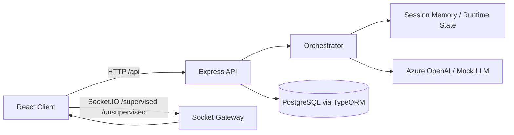

# GDE + MIT IEDU Simulation Platform

[](./)
[](./LICENSE)
[](./)
[](./server/src/core/realtime)
[](./server/src/core/tools/llm.ts)

[](https://www.typescriptlang.org/)
[](https://react.dev/)
[](https://vitejs.dev/)
[](https://expressjs.com/)
[](https://socket.io/)
[](https://typeorm.io/)
[](https://www.postgresql.org/)
[](https://www.docker.com/)

## Project Goal

Ez a projekt egy **agent-mode oktatási szimulációs platform**:

- valós idejű (Socket.IO) osztálytermi interakciókkal,
- teacher + student agent viselkedéssel,
- kommunikációs gráf vizualizációval,
- élő állapot- és metrika chartokkal,
- supervised és unsupervised futási móddal.

A cél az, hogy realisztikusan modellezhető legyen, hogyan változik egy osztály dinamika, figyelem, és tudásátadás egy teljes tanórán.

## Main Features

- **Dual simulation mode**
  - `supervised`: a felhasználó be tud avatkozni (teacher whisper, task assignment).
  - `unsupervised`: a teacher agent autonóm adaptációt végez.
- **Realtime classroom graph**
  - node-ok: teacher + students,
  - edge-ek: teacher broadcast, teacher->student, student->teacher, student<->student.
- **Live bubbles & action stream**
  - kommunikációs buborékok az avatarok körül,
  - student állapotból levezetett akciók.
- **Metrics and analytics**
  - attention/boredom/emotion idősorok,
  - “How well did they grasp the material?” százalékos összegzés.
- **Production-ready backend baseline**
  - typed Express API, request id + structured logger, middleware-k, health endpoint.
- **Azure OpenAI integration**
  - Azure OpenAI hívás támogatás,
  - deterministic fallback/mock viselkedés.

## Repository Layout

```text
.
├── client/                     # React + Vite frontend (PrimeReact + charts + graph)
├── server/                     # Express + TypeScript backend (Socket.IO + TypeORM)
├── nginx/                      # reverse-proxy config (/api + /socket.io -> server)
├── docker-compose.yml          # local postgres helper
├── docker-compose.prod.yml     # full production stack
└── deploy.sh                   # Docker Hub build/push script
```

## Architecture Snapshot



## API Overview

Base URL: `http://localhost:3000/api` (vagy a beállított `PORT`).

### Health

- `GET /api/health`

### Simulation Sessions

- `POST /api/sessions` - session indítás
- `GET /api/sessions/:id` - session summary
- `POST /api/sessions/:id/turn` - turn futtatás
- `POST /api/sessions/:id/task-assignment` - supervised task assignment
- `GET /api/sessions/:id/stream` - SSE placeholder (jelenleg 501)

### Classroom & Student Management

- `GET|POST /api/classrooms`
- `GET|PUT|DELETE /api/classrooms/:id`
- `GET /api/classrooms/:id/students`
- `GET|POST /api/students`
- `GET|PUT|DELETE /api/students/:id`

## Realtime (Socket.IO)

Path: `/socket.io`  
Namespaces:

- `/supervised`
- `/unsupervised`

Client -> server:

- `subscribe`
- `unsubscribe`
- `ping`
- `command`
- `supervisor.whisper` (csak supervised)

Server -> client:

- `connection.ready`
- `subscription.confirmed`
- `subscription.removed`
- `system.pong`
- `system.error`
- `simulation.session_created`
- `simulation.turn_processed`
- `simulation.graph_updated`
- `simulation.student_states_updated`
- `simulation.agent_turn_emitted`
- `simulation.task_assignment_required`
- `simulation.supervisor_hint`

## Local Development

## 1. Prerequisites

- Node.js 20+
- npm
- Docker (Postgres-hez ajánlott)

## 2. Start PostgreSQL (local)

```bash
docker compose up -d postgres
```

## 3. Backend setup

```bash
cd server
npm install
cp .env.example .env
npm run dev
```

Megjegyzés: a szerver induláskor futtatja a migrációkat automatikusan.

## 4. Frontend setup

```bash
cd client
npm install
npm run dev
```

Ajánlott `client/.env`:

```bash
VITE_API_URL=http://localhost:3000/api
VITE_SOCKET_URL=http://localhost:3000
```

Frontend: `http://localhost:5173`

## 5. TypeORM migration manuálisan

```bash
cd server
npm run typeorm:migrate
```

## Production Deployment

## Docker images build + push

```bash
./deploy.sh <dockerhub_username> [tag] [vite_api_url]
```

Példa:

```bash
./deploy.sh mydockeruser v1.2.0 https://mydomain.com/api
```

## Full stack indítás prod compose-szal

```bash
docker compose -f docker-compose.prod.yml up -d
```

Fontos env változók `docker-compose.prod.yml`-hez:

- `DOCKERHUB_USERNAME` (kötelező)
- `IMAGE_TAG` (opcionális, default: `latest`)
- `POSTGRES_DB`, `POSTGRES_USER`, `POSTGRES_PASSWORD`
- `AZURE_OPENAI_API_KEY`, `AZURE_OPENAI_ENDPOINT`, `AZURE_OPENAI_DEPLOYMENT`

Reverse proxy routing:

- `/api/*` -> `server`
- `/socket.io/*` -> `server`
- minden más -> `client`

## Tech Notes

- Backend: `Express + TypeScript + TypeORM + Socket.IO + Zod`
- Frontend: `React + Vite + PrimeReact + Chart.js + Tailwind`
- Logging: request id + structured logs
- Security baseline: safety guardrails + error middleware
- Auth: MVP-ben még nincs bekötve (placeholder van)

## License

MIT - lásd: [LICENSE](./LICENSE)
